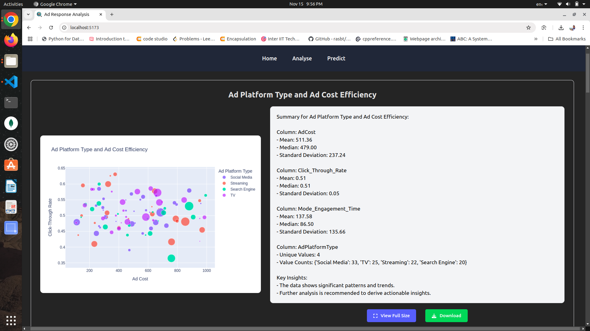
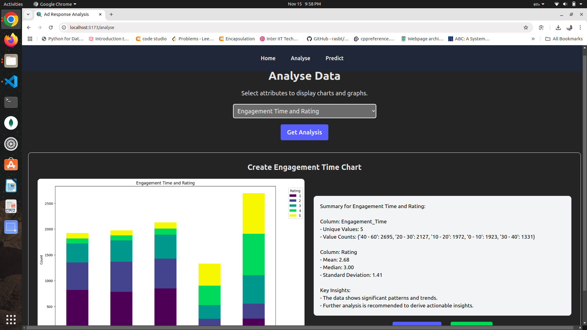
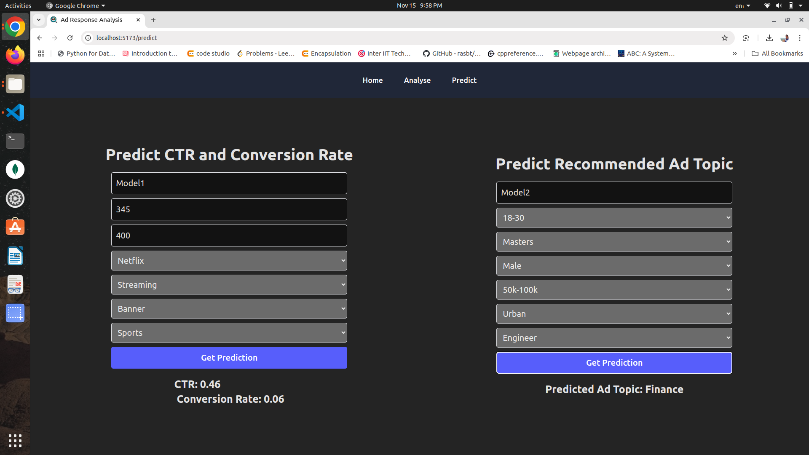

# Advertisement Response Analysis Project

## Introduction
This project analyzes advertisement responses using a **Django backend** and a **Vite+React frontend**. It includes scripts to load, clean, and transform data, which are executed within Docker containers. Data is stored in a **MongoDB database**, and the project can be run with or without Docker by adjusting the MongoDB connection strings. There are three pages on the frontend which are home, analyse and predict. Home page displays most impactful plots and analytics. Analyse page allows users to select a combination of attributes to **plot** and get **analytics**. Predict page allows users to **preidct CTR and Conversion Rates** for an advertisement given its attributes using **Machine Learning Models**.

---

## Screenshots of Frontend

#### Home Page


#### Analysis Page


#### Predict Page


---

## Directory Structure

```
project-root/
├── backend/
├── frontend/
├── data/
├── credentials/
├─ ext_and_load.py
├─ ld_gform_responses.py
├─ clean_and_transform.py 
├─ dockerfile 
├─ .env
├─ .dockerignore
├─ .gitignore
├─ package.json
├─ package-lock.json
├─ requirements.txt
└── docker-compose.yml
```

## How It Works

- **Backend (Django):** Serves API endpoints for data handling.
- **Frontend (Vite+React):** Provides a user interface to interact with the project.
- **Data Loading and Transformation Scripts:**
  - **ext_and_load.py**: Loads data from an Excel file into MongoDB.
  - **ld_gform_responses.py**: Loads new entries from Google Forms into MongoDB.
  - **clean_and_transform.py**: Cleans and transforms data, storing results in MongoDB.

---

## Project Architecture Overview


---

## Initialization

### Prerequisites

- **Python 3.9** or higher installed on your machine.
- **Docker** and **Docker Compose** installed on your machine.
- A **MongoDB** instance, either locally or in a Docker container.
- A google sheets api credentials and google form to collect data from google forms and fetch it using google sheets api


---

### Steps to Initialize the Project

1. **Clone the Repository:**

```bash
git clone https://github.com/viveksapkal2793/Advertisement-Response-Analysis.git
cd Advertisement-Response-Analysis
```

2. **Set Up Environment Variables:**  
   Create a `.env` file in the root directory with the following content:

```
MONGO_URI=<your_mongodb_uri>
SPREADSHEET_ID=Your google spreadheets id which is collecting the google form responses
```

3. Run the following command to install python modules for running data loading and cleaning scripts

```
pip install -r requirements.txt
```

4. Similarly run the same command in Backend directory

```
cd Backend
pip install -r requirements.txt
```

5. Run the following command in Frontend directory to install node modules and dependencies

```
cd Frontend
npm install
```

### 3. Modify MongoDB Connection Strings
Adjust the MongoDB connection strings in the scripts (`ext_and_load.py`, `ld_gform_responses.py`, `clean_and_transform.py`) depending on your environment:

- **For Scripts and Backend running in Docker:** Use the following connection string:
```
mongodb://172.17.0.1:27017 # for linux
mongodb://host.docker.internal:27017 # for windows
```
- **For Without Docker:** Use your MongoDB instance's URI, typically:
```
mongodb://127.0.0.1:27017
```

### 4. Run Project without docker

- To run project without docker run the following commands in different terminals in Frontend and Backend directories repsectively

```
cd Frontend
npm run dev
```

```
cd Backend
python3 manage.py runserver
```

### 5. Build and Run Docker Containers
- To build and run the Docker containers, execute the following command:

```
docker-compose up --build
```
- To stop the running containers and delete them, execute the following command:
```
docker-compose down
```

### 6. Access the Frontend when running on localhost at port 5173

Open your browser and navigate to [http://localhost:5173](http://localhost:5173).

### 7. Access the Backend when running on localhost at port 8000

The Django backend will be running at [http://localhost:8000](http://localhost:8000).

---

## Important Notes

- **Data Persistence:** The `tmp` directory is mounted as a volume in the Docker containers to persist temporary files.
- **Running Scripts:** The scripts (`ext_and_load.py`, `ld_gform_responses.py`, and `clean_and_transform.py`) are executed within Docker containers as defined in the `docker-compose.yml` file.
- **Environment Configuration:** Ensure that environment variables and MongoDB connection strings are correctly set up before running the project.

---

## Docker Compose Services

- **runner:** Runs the `run_all.py` script once.
- **scheduler:** Runs the `ld_gform_responses.py` script every 2 minutes.
- **transformer:** Runs the `clean_and_transform.py` script every 5 minutes.
- **frontend:** Runs the React frontend.
- **backend:** Runs the Django backend.

---

## Contributors

- [Vivek Sapkal](viveksapkal2003@gmail.com)
- [Kapil Yadav](b22ai024@iitj.ac.in)
- [Bhagwan Arsewad](b22ai010@iitj.ac.in)